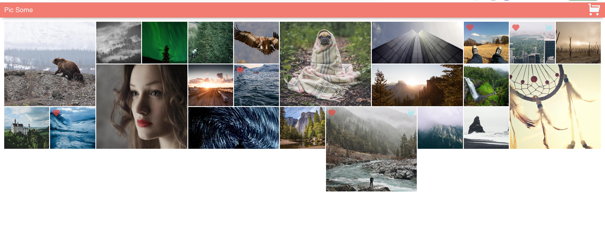
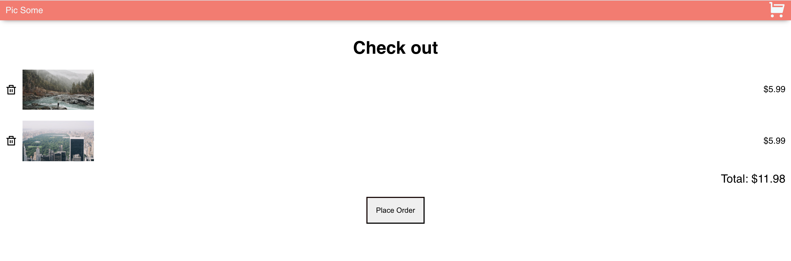

# Online Pics Store

> A online pictures store website with limited functionality created for practice purposes.
>
> 👉 [Live demo to be added]()





## Why I've build this?

Created this Web App following the [React Advance course path on Scrimba](https://scrimba.com/).

An project in which I've got to work with the `Context API`, `custom Hooks` and `refs` among others.

## Technologies

This app was build with:

- [React](https://reactjs.org/docs/create-a-new-react-app.html)
- Images pulled from an JSON file

## Install and Play

```
git clone https://github.com/stefi23/online-pics-store.git
$ cd online-pics-store
$ npm install
$ npm start
```
